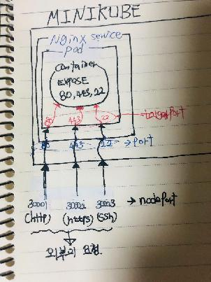

# ft_serivces

-----
#### Todo
- 서비스 좀비로 만들기
- wordpress - mysql - phpmyadmin

-----
#### Pod가 아닌 Deployment로 컨테이너를 생성해야 하는 이유.
- 하나의 파드는 여러 컨테이너가 엮여서 하나의 서비스를 만들 수 있다.
- 엄밀히 말하면 서비스를 만드는건 아니다. 파드는 자체적으로 여러 컨테이너를 통해서 어떤 하나의 기능을 실행하고 있는데 이 기능은 외부로 노출되지 못하고 파드 자신에 갇혀서있는 상황이다. 물론 그렇게만 해도 되는 상황이 있겠지만 보통의 경우에는 이 ***기능***이 ***다른 파드 또는 외부***로 노출되기를 원할 수 도 있다.
- 그걸 가능하게 해주는게 바로 ***서비스 객체***다.
- 서비스 객체는 생성 될 때 어떤 파드를 서비스 할 지 결정한다. 만약 파드가 죽으면? 그러면 서비스 또한 끝난다. 즉 더 이상 아무런 기능을 하지 못하는 것.
- 만약 죽은 파드가 절대로 멈추면 안되는 서비스라면 큰 일이 생길 수 도 있지 않을까?
- 그렇다면 절대로 파드가 죽지 않게 만들자!
- 어떻게 하면 파드가 절대 죽지 않게 만들 수 있을까....
- 파드가 여러 컨테이너를 포함하는 객체인것처럼 파드를 관리하는 더 큰 상위 집합(= 객체)을 만들면 되지 않을까?
- 그리고 이 파드를 포함하는 객체는 만약 파드가 죽으면 새로운 파드를 만드는 기능을 가지면 어떨까?
- 그리고 새롭게 생긴 파드에 서비스가 연결되서 서비스를 끊기지 않게 만들면 좋을거 같다.
- 이렇게해서 디플로이먼트 객체가 생겼다.
- ***디플로이먼트 객체***를 생성하는 yaml 파일을 보면 아래쪽에 spec.template 부분이 있음. 이 부분이 파드와 컨테이너를 선언하는 부분.

-----
#### 참고
[참고](https://itnext.io/kubernetes-in-a-nutshell-blog-series-c3a97fce9445)

-----
#### setup.sh
- 클러스터
   ```
   export MINIKUBE_HOME=~/goinfre
   minikube start --vm-driver virtualbox
   ```
- 리눅스
   ```
   minikube start
   ```
-----
#### 
- Deployment
   - [Deployment](https://arisu1000.tistory.com/27833)
   - [공식문서](https://kubernetes.io/ko/docs/concepts/workloads/controllers/deployment/#selector)
- Service
   - [공식문서](https://kubernetes.io/ko/docs/concepts/services-networking/service/)
   - [Service1](https://arisu1000.tistory.com/27838?category=787056)
   - [Service2](https://arisu1000.tistory.com/27839?category=787056)
- Pod
   - [공식문서](https://kubernetes.io/ko/docs/concepts/workloads/pods/pod-overview/)
   - [한글사이트](https://arisu1000.tistory.com/27829?category=787056)
- [ConfigMap](https://arisu1000.tistory.com/27843?category=787056)
- [Secret](https://arisu1000.tistory.com/27844)
- [Volume](https://arisu1000.tistory.com/27849?category=787056)
- [Metrics-server](https://arisu1000.tistory.com/27856?category=787056)

-----
#### Metallb
- Service 객체의 Type을 NodePort가 아닌 LoadBalancer로 한다. 매우 중요!!!!
- [참고사이트](https://medium.com/@shoaib_masood/metallb-network-loadbalancer-minikube-335d846dfdbe)
- 설치
   1. Kubectl apply -f https://raw.githubusercontent.com/google/metallb/v0.8.1/manifests/metallb.yaml
   2. [Layer2 Configuration](https://metallb.universe.tf/configuration/) 부분 yaml 파일로 만들어서 사용하기.
- 테스트
   ```
   kubectl get services
   ```
   이후 각 서비스의 External-ip로 접속하면 된다.

#### Metallb && MINIKUBE 두 개의 키워드를 같이 검색하면 잘 나오는듯?
-----
#### Volume은 왜 필요한가?
- Kubernetes에서 Deploy를 하면 파드가 생성된다. 그리고 파드는 하나의 서비스를 실행할 수 있다.
- Deploy된 Pod들은 의도치 않은 이유로 인해 삭제되었을 때 자동으로 복구 되는 힐링기능이 있다.
- 파드가 자동으로 힐링된다고 하자. 거기까지는 좋다. 하지만 파드가 자동으로 다시 시작이 되면 이전에 삭제된 파드에 있던 데이터는 어떻게 되지?
- docker run -it alpine /bin/sh 로 작업을 하고 exit 하면 작업했던 모든 기록들이 삭제되는걸 익히 알고있듯이 파드가 삭제되면 안에 있던 데이터들은 다 날아가는게 아닌가? 만약 그 안에 아주 중요한 데이터가 있다고 하면 자동 복구라는건 빛살좋은 개살구 아닌가?
- 일단은 삭제 되는게 맞다! 하지만 Kubernetes는 파드 안에 있는 컨테이너의 어느 특정 위치를 Volume로 지정해서 데이터를 저장시키는 엄청난 기능이 있다!
- 이 기능을 사용하면 파드가 재시작되어도 우리가 지정했던 그 위치의 데이터는 삭제되기 이전 그 상태 그대로 남아있다!
- Volume 기능은 데이터를 저장할 목적으로도 사용되지만 이 목적만이 아니라 어떤 파일 자체를 컨테이너에 넣을 수 있는 기능도 제공한다.(보통 설정 파일을 넣는 역할을 하는거 같다.)
   - 영구적으로 파일을 저장 -> persistentVolumeClaim
   - 설정 파일 넣기 -> ConfigMap
- 먼저 Deployment의 spec.containers.VolumeMounts 설정을 통해서 Volume 될 위치를 정한다.
- spec.Volume에서 persistentVolumeClaim, configMap 등을 지정해준다.
- ConfigMap은 보통 외부로 노출되어도 되는 설정일 경우 kind:ConfigMap으로 하고 외부로 노출되면 안되는 경우는 kin:secret 으로 한다.
- [ConfigMap](https://itnext.io/learn-how-to-configure-your-kubernetes-apps-using-the-configmap-object-d8f30f99abeb)
- [Secret](https://medium.com/better-programming/how-to-use-kubernetes-secrets-for-storing-sensitive-config-data-f3c5e7d11c15)
- [Volume]
   - [한글사이트](https://itnext.io/learn-about-the-basics-of-kubernetes-persistence-part-1-b1fa2847768f)

-----
#### 컨테이너로 파일 전송하는 법 -> 쿠버네티스 파드 내의 컨테이너로 전송하기 위해서는 docker를 kubectl로 mycontainer를 pod 이름으로 바꿔주면 된다.
- 호스트에서 컨테이너로
  ```
  docker cp /path/foo.txt [mycontainer]:/path/foo.txt
  ```
- 컨테이너에서 호스트
  ```
  docker cp [mycontainer]:/path/foo.txt /path/foo.txt
  ```

-----
#### Kubectl 명령어

- [Kubectl cheat sheet](https://kubernetes.io/ko/docs/reference/kubectl/cheatsheet/)

-----
#### Minikube 명령어

- 기본 Port range 바꾸는 법
   ```
   minikube start --extra-config=apiserver.service-node-port-range=21-32767
   ````
- Dashboard
  ```
  minikube dashboard
  ```
- Service 확인하기
  ```
  minikube service list
  ```
- minikube ip -> 나중에 ingress로 연결되서 nginx index.html 화면 띄움
  ```
  minikube ip
  ```
- 애드온 확인
  ```
  minikube addons list
  ```
- addon 활성화
  ```
  minikube addons enable [addome]
  ```
- env
  ```
  eval $(minikube docker-env)
  ```

-----
#### yaml 파일
- :punch:[쿠버네티스 서비스 생성 가이드](https://waspro.tistory.com/520)
- [port vs nodePort vs targetPot](https://matthewpalmer.net/kubernetes-app-developer/articles/kubernetes-ports-targetport-nodeport-service.html)
- ports
   - nodePort : 외부와 미니큐브를 연결시켜줌
   - port : 미니큐브와 서비스 객체를 연결
   - targetPort : 파드와 서비스 객체를 연결
   - 최종적으로 외부의 요청은 컨테이너가 EXPOSE하고 있는 포트와 연결된다.
-----
#### nginx

- [Nginx in alpine](https://wiki.alpinelinux.org/wiki/Nginx)
- [Very good](https://www.cyberciti.biz/faq/how-to-install-nginx-web-server-on-alpine-linux/)
- [index.html 꾸미기](https://www.w3schools.com/tags/tryit.asp?filename=tryhtml5_input_type_button)
- ssh 연결
  ```
  minikube service nginx // 포트를 찾고
  ssh sanam@(minikube ip) -p PORT
  ```
- 301...to...443의 의미가 뭘까...
   - http://localhost 로 접속하면 자동으로 https 로 이동한다는걸까..?
-----
#### ftps

- 파일 전송
  ```
    curl ftp://EXTERNAL-IP:21 --ssl -k --user sanam -T filename
    enter password : 123456789
    // --ssl : ftps 쓰기 위함
    // -k : 인증 문제 무시
  ```
- 파일 다운로드
   ```
   curl -u sanam:123456789 'ftp://EXTERNAL-IP:21/toDOWNLOAD' --ssl -k -o ./DOWNLOADED
   ```
- 파일 전송 확인
  ```
    kubectl get pods // ftp 파드 이름 확인
    kubectl exec -it [POD_NAME] -- sh // ftps 컨테이너 접속
    cd ftps/sanam // 전송된 파일 저장되는 곳
  ```

-----
#### wordpress, Mysql, Phpmyadmin
- 여기서 목표는 wordpress의 데이터가 담겨있는 mysql 을 구동하고 wordpress와 phpmyadmin을 연결시키는 것.
- 따라서 먼저 mysql을 설치하고 phpmyadmin을 mysql 서버에 연동시킨 다음에 wordpress을 실행하자.
- ***wordpress의 데이터는 마지막에 넣어주자. 왜냐하면 넣어주는 데이터인 wordpress.sql에는 wordpress의 url, 호스트의 주소.. 가 Service 객체에 주어지는 external ip와 같아야한다. 따라서 wordpress.sql을 서비스가 된 후에 ip 정보를 수정해서 mysql에 넣어주는 방식으로 하자.***

##### 도커 파일로 만들어서 하는게 아닌 ***쿠버네티스 디플로이먼트 객체를 생성하고 생성 된 파드 내의 컨테이너에서 작업하자!!!!***
##### 주의 할 점은 특정 명령을 쓰지 않으면 파드가 바로 죽어버리는 상황이 발생하므로 command를 써주자.

```
apiVersion: apps/v1
kind: Deployment
metadata:
  name: mysql
  labels:
    app: mysql
spec:
  selector:
    matchLabels:
      app: mysql
  replicas: 1
  template:
    metadata:
      labels:
        app: mysql
    spec:
      containers:
      - name: mysql
        image: alpine
        ports:
          - containerPort: 3306
        command: ["/bin/sh"]
        args: ["-c", "while true; do echo hello; sleep 10;done"]
```

***1. mysql***
- mysqld -> mysql server
- 처음 설치하면 mysql server을 실행할 준비가 되어있지 않다. 따라서 초기 세팅이 필요하다. 이때 사용하는 명령어는 [mysql_install_db](https://dev.mysql.com/doc/refman/5.7/en/mysql-install-db.html). 명령을 실행하면 mysql data directory를 초기화 시키고 시스템 테이블을 만든다.
- 여기서 root는 시스템 user다. 다른 user를 직접 만들고 해도 되는데 그때는 비밀번호 입력이 필요하다. 따라서 간편한 root를 쓰자
- mysql 서버를 만들었으니깐 이제 데이터를 넣어야 한다.
- 데이터를 넣기 위해서는 먼저 데이터의 테이블(?)을 생성해줘야 한다. 테이블을 wordpress로 만들어 주자.
- 그리고 이 만들어진 wordpress 테이블에 접근 할 수 있는 계정을 생성하자. (id: admin, password: tkdgur123)
- 여기서 중요한게 db 생성 앞 뒤로 **flush privileges**를 해줘야 한다. 이 명령은 mysql server에게 지금 만든 테이블을 reload하라고 알려주는 역할을 한다. 왜인지는 모르겠지만 앞 뒤 모두 해줘야 정상적으로 작동한다.
- 마지막으로 mysqld --user=root 명령으로 서버를 시작하자.
- 그 다음으로 서비스.yaml으로 서비스 객체를 만들자.
   ```
   mkdir -p /run/mysqld
   mysqld_install_db --user=root // mysql server 초기 세팅
   mysqld --user=root --bootstrap < init_mysql // bootstrap 옵션을 사용하면 서버를 실행하지 않은 상태로 DB 테이블을 만들 수 있다. 따라서 db 를 넣어줄 때 이 옵션을 넣어주자. 솔직히 잘 모른다.
   mysqld --user=root // 서버 실행 
   ```
- init_mysql
   ```
   FLUSH PRIVILEGES; // 테이블을 reload 하라는 명령. 앞 뒤 모두 해줘야지 정상적으로 작동한다.
   CREATE DATABASE wordpress;
   GRANT ALL PRIVILEGES ON *.* TO 'admin'@'%' IDENTIFIED BY 'tkdgur123' WITH GRANT OPTION;
   FLUSH PRIVILEGES;
   ```

***2. phpmyadmin***
- 앞에서 mysql을 이용해서 데이터베이스를 생성했다.  
- 흠.. 근데 난 mysql 명령어 써서 DB 확인하고 생성하고.. 백업하고 이 모든 과정이 너무 복잡해. 못해먹겠다---> 그래서 있는게 phpmyadmin
- phpmyadmin을 사용하면 mysql을 손쉽게 조작하고 볼 수 있다.
- 아래는 세팅과정
- phpmyadmin 설치에 필요한 여러가지들을 다운 받아 주자.(Dockerfile 참고)
- 그리고 먼저 만들어 놓은 config.inc.php도 /etc/phpmyadmin/에 넣어준다.
- config.inc.php은 접속할 mysql server의 정보를 입력해주면 됨.
- /\* Server parameter \*/ 이 부분만 손보면 된다. 이 부분은 이름 그대로 phpmyadmin이 관리할 mysql server다. port, user, password, 등을 앞서 설정해준 그대로 세팅해주면 된다.
- 그런데 host 부분이 조금 이상한데? 보통 이 부분에는 127.0.0.1, localhost, 또는 특정 ip 주소가 들어가야 할 텐데 여기서는 왜 mysql을 적어준거지?
- 이 부분은 쿠버네티스로 ip를 관리하는 법과 연관이 된다. ***쿠커네티스 네트워크에서는 특정 service에 IP 주소가 아닌 서비스의 이름으로 접근할 수 있다!!!*** 따라서 mysql 서비스의 주소가 아닌 서비스 이름인 mysql을 적어준 것. 물론 이 방법은 외부에서는 불가능하고 쿠버네티스 안의 객체들끼리의 통신방법. 외부에서는 
- 여기서 configMap이라는 새로운 기능을 알아보자. 이 기능은 설정파일 등을 Dockerfile에서 건네주는게 아닌 yaml 파일로 건네줄 수 있게 만들어 주는 기능이다. 이건 올려놓은 yaml파일을 보고 하면 된다.
- 이제 php -S 0.0.0.0:5000 -t /etc/phpmyadmin/ 명령으로 phpmyadmin 를 시작하고 서비스 객체를 만들자.
- phpmyadmin의 경우 mysql과 다르게 외부에서 접근할 수 있어야 하므로 type을 LoadBalancer로 한다.
- 대쉬보드에 phpmyadmin의 endpoint로 접속하자.
- id: admin, password: tkdgur123
- 왼쪽에 보면 wordpress라고 있다. 하지만 아직은 비어져있다.
- wordpress에서 세팅을 하면 이 부분이 채워진다.

***3. wordpress***
- 여기서도 위와 마찬가지로 deployment로 파드를 만들고 컨테이너에 커맨드를줘서 자동으로 exit가 안되게 만들어주자.
- 파드가 생성되었으면 컨테이너로 접속해서 wordpress 설치에 필요한 파일들을 다운 받아주자. 그리고 wp-config.php 파일을 /etc/wordpress/ 위치에 넣어주자.
- 그리고 여기서도 php 관련 파일들을 다운 받아야한다. php 서버에 신호를 계속 보내야 하기 때문.
- 필요한 파일들을 설치해줬으면 바로 php -S 0.0.0.0:5050 -t /etc/phpmyadmin 을 해주자
- 그리고 wordpress-service.yaml을 이용해서 서비스 객체를 만들어주자.
- 대쉬보드에 접속해서 wordpress의 endpoint에 접속하자. 접속하면 처음 하는 부분이 나온다. 이 부분은 admin을 만드는 부분이므로 나중에 헷갈리지 않게 id : admin, password : 마음대로 로 만들어주자.
- 이렇게 admin을 생성했으면 pdf에 따라 여러 user를 만들어주자
- 여기까지 했으면 이제 post를 올리거나 코멘트를 달아보자.
- ***마지막으로 지금까지 wordpress 조작한 내용들을 export 하자!***
- 이 부분은 먼저 실행해 놓은 phpmyadmin에서 하면 된다.
- phpmyadmin의 endpoint에 접속하자. 아이디 비번은 mysql server 만들때 사용했던 걸 이용하면 된다.
- 접속하면 왼쪽에 wordpress를 누루자. 아까전에는 볼 수 없었던 데이터가 생성된 걸 확인할 수 있다. 그리고 위를 보면 ***EXPORT*** 부분이 있다. 이 버튼을 눌러서 지금까지 저장한 내용을 추출하자.

- 지금까지 mysql, phpmyadmin, wordpress 등을 세팅하는 법을 알아봤다. 이제 이 내용들을 Dockerfile에 저장하고 자동화 시키는 작업을 하면 된다.

***wordpress같은 경우 설정 파일에 있는 host의 주소가 external ip와 같거나 비슷해야지 wordpress 사이트에 접속이 된다. 따라서 인위적으로 값을 바꿔줘야하는데 두가지 방법있음***
   1. wordpress_service.yaml에서 externalIPs 옵션을 주는 방법. 이 하지만 이 방법을 쓰면 wordpress가 노출되는 포트가 두개가 되므로 pdf에서 컷 된다. 따라서 아래 방법 사용.
   2. 일단 wordpress를 실행 시키는데, 이 때 wordpress.sql을 데이터 베이스에 넣지 않는다. 먼저 서비스를 문제 없이 작동시키고 서비스가 돌아가면 생기는 ***external ip***를 가져와서 wordpress.sql 파일과 wp-config.php 파일에 넣어준다. 그리고 kubectl 명령어들을 이용해서 wordpress 컨테이너에 설정 파일들을 다시 넣어주고 데이터베이스에 wordpress.sql 넣어준다.
      - 이 방법말고 configMap 파일 형태를 이용해서 하는게 더 간편할거 같다!!
         - 먼저 wordpress.sql 데이터를 넣지 않은 상태로 시작한다.
         - 그리고 external ip가 나오면 그 값을 wordpress_sql.yaml의 host 부분에 넣어준다. 
         - 이 후 kubectl apply -f wordpress_sql.yaml로 적용해주고 kubectl exec 를 통해서 wordpress.sql을 데이터베이스에 넣어준다.(흠... 안되려나?)
      - wordpress에 데이터를 넣어줄 때 한번에 들어가는 경우는 거의 없다. 쉘 스크립트 등을 통해서 데이터가 잘 들어갈 때 까지 무한 반복 시켜주자.(until 명령어 사용하면 편함)

- Dockerfile
  - [Wordpress in alpine](https://wiki.alpinelinux.org/wiki/WordPress)
  - [Mysql in alpine](https://wiki.alpinelinux.org/wiki/MariaDB)
  - [Phpmyadmin in alpine](https://wiki.alpinelinux.org/wiki/PhpMyAdmin)
- kustomization
  - [wordpress mysql 한국어](https://cleanupthedesk.tistory.com/16)
  - https://wiki.alpinelinux.org/wiki/WordPressa
  - [공홈 가이드](https://kubernetes.io/ko/docs/tutorials/stateful-application/mysql-wordpress-persistent-volume/)
  - [차근차근 가이드](https://medium.com/@containerum/how-to-deploy-wordpress-and-mysql-on-kubernetes-bda9a3fdd2d5)
  - [What is PV, PVC?](https://kubernetes.io/ko/docs/concepts/storage/persistent-volumes/)

-----
#### Grafana, Influxdb, Telegraf
- telegraf는 각종 데이터를 수집한다.
- influxdb는 시계열 데이터를 위한 DB
- grafana는 데이터를 시각화한다.
> telegraf로 수집한 데이터를 influxdb로 넘기고 grafana로 시각화하자!
>> influxdb, telegraf, grafana 순서로 세팅하자!

***1. INFLUXDB***
- influxdb는 시계열 데이터를 저장하는 DB다. 주로 Grafana 같은 대쉬보드 툴과 연계하여 모니터링 용도로 사용된다.
- 그렇다면 왜 Influxdb를 사용하는가?
   - 시계열 데이터를 저장하고 조회, 효율성등이 아주 좋다.
   - 시계열DB 트렌드 자료를 보면 influxdb의 점유율은 압도적이고 그 증가율 또한 엄청나다.
- 사용법
   ```
   IN ALPINE
   
   1. influxdb 설치
      - apk add influxdb
   2. influxdb.conf 파일 수정
      - vim /etc/influxdb.conf
      - 보면 옵션에 대한 설명이 주석으로 달려있다. 설명을 읽어보고 맨 마지막 줄에 있는 옵션을 사용하면 된다.
      - 설정은 그냥 디폴트로 다 사용하면 될거 같다. 하지만 클러스터 환경에 제약이 있기 때문에 [ data ] 부분에 있는 메모리 관련해서는 디폴트보다 작게 할 필요가 있는거같다.
      - [ http ] 부분을 보면 ssl 관련 설정이 있는데 만약 채점 기준에 nginx 를 제외한 다른 서비스들도 ssl을 사용해야 한다고 하면 여기를 수정하면 될 듯.
      - [[graphite]] 부분을 보면 templates 설정이 있는데 이 부분 그래픽화를 어떻게 할지 결졍하는듯. 여기를 참고https://gatling.io/docs/current/realtime_monitoring
   ```
***2. TELEGRAF***

- telegraf는 data collector이다.
- 그렇가면 도대체 어디서 데이터를 수집하지?
   - ***DOCKER*** -> input
- 데이터를 수집하는걸로 끝인가? 노노 수집한 데이터를 저장해야 한다. 어디에?
   - ***INFLUXDB*** -> output
- 따라서 ***INPUT과 OUTPUT***을 설정하자!!!!
- 설정 방법
   ```
   - output plugin : 우리는 데이터를 저장할 보관소로 influxdb를 선정했으므로 db의 아이디와 비밀번호 그리고 url등을 입력해주면 된다.
   - input plugin : output과 달리 input은 뭔가 복잡하다. 복잡한 이유는 데이터를 받아 올 수 있는 소스의 종류가 너무 많기 때문이다...
   예를 들면 aws, azure 등? 우리는 쿠버테니스 클러스터 내에서 동작하는 파드(컨테이너)에서 나오는 데이터를 수집하므로 docker 부분을 찾고
   주석을 풀어주기만 하면 끝!
   ```
   
***3. GRAFANA***
- 데이터를 수집하고 저장까지 했으므로 이제 GRAFANA를 이용해서 시각화를 하자.
- 설정파일을 만지기 전에 필요한 세팅을 하자
- 먼저 그라파나를 어떻게 사용하는지 조금 알아보자
   - docker run -it -p 30000:3000 alpine /bin/sh -> 컨테이너 접속
   - apk add grafana --repository http://dl-3.alpinelinux.org/alpine/edge/testing/ --no-cache -> 그라파나 인스톨
   - /usr/sbin/grafana-server --homepath=/usr/share/grafana -> 그라파나 실행
   - localhost:30000 접속 (클러스터라면 127.0.0.1:30000)
   - 처음 로그인 id, password는 amdin이다. 이후 비밀번호 새롭게 세팅 후 접속
   - 왼쪽 목록에서 Crate dashboard를 누르자
   - 대쉬보드를 만들기 위해서는 DB가 필요하다. db를 만들러가자. 왼쪽 톱니바퀴 모양의 configuration의 datasource를 누르자.
   - 여기서 사용할 db를 선택하고 데이터를 가지고 대쉬보드를 만들 수 있다.
- 그럼 이제 설정 파일을 보자. 일단 /usr/share/grafana에 들어가보자.
   ```
   /usr/share/grafana/conf # tree
   .
   ├── defaults.ini
   ├── ldap.toml
   ├── ldap_multiple.toml
   ├── provisioning
   │   ├── dashboards
   │   │   └── sample.yaml
   │   ├── datasources
   │   │   └── sample.yaml
   │   └── notifiers
   │       └── sample.yaml
   └── sample.ini
   ```
   - 여기서 주목할건 ***sample.ini 파일과 provisioning 폴더***
- sample.ini
   - 이 파일은 샘플파일에서 필요한 부분들을 주석해제 해주면 된다. 대부분 값들을 그대로 주석만 풀고 사용하면 된다.
- ***PROVISIONING***
   - 이 폴더가 정말로 중요하다. 아까전에 그라파나를 실행했을 때 대쉬보드는 만들어져 있지 않고 DB 또한 열결되어 있지 않았다.
   - 그렇다면 ft_services를 실행할 때마다 이런 값들을 다 설정해줘야하는건가?
   - ***NO!!*** 이 동작들을 자동화 시킬 수 있다!!!
   - 자동화 시키는게 바로 ***datasource와 dashboards 폴더 안에 있는 yaml 파일이다. [이 사이트의 마지막 부분 코드블럭을 참고하자](https://grafana.com/docs/grafana/latest/features/datasources/influxdb/)***
      - datasource.yaml 이 파일은 DB 연동을 자동화 시킨다.
      - dashboards.yaml 이 파일은 만들어져 있는 대쉬보드가 어디에 있는지를 가르쳐주는 역할을 한다.
      - grafana는 이제 시작할 때 datasource.yaml 을 보고 DB를 연동시킨 다음에 dashboards.yaml이 가르쳐주는 위치로 가서 json 형태로 만들어져 있는 dashboards를 찾고 시각화시킨다.
- 대쉬보드 만들기
   - 일단 대쉬보드를 만들기 전에 쿠버네티스를 실행하고 대쉬보드를 만들기 원하는 모든 컨테이너를 실행시키자.
   - 그라파나의 external ip를 통해 웹에 접속하자.
   - 이후 create dashboard를 누르자. 이후 Add new panel를 누른다.
   - 현재 데이터베이스를 디폴트로 사용하고 있다. 이 디폴트를 influxdb로 바꿔주자.
   - 그러면 A 라는 이름의 표가 있다.
   - 위의 작업을 했다면 influxdb 컨테이너에 접속하자. 아래는 mysql의 traffic 사용량을 그래프화 시키는 작업.[여기 참고](https://docs.influxdata.com/influxdb/v1.8/query_language/explore-schema/)
      ```
      // 인플럭스 db 시작
      influx
      // telegraf는 데이터 베이스의 이름
      use telegref
      // measurements는 데이터베이스의 단위. docker, docker_container_cpu ... 등의 목록이 나온다.
      // 이중에서 트래픽 관련된 데이터는 docker_container_net에 있다.
      show measurements 
      // tag 확인하기. 우리가 시각화해야할 mysql과 같은 컨테이너들은 app으로 되어 있다.
      show tag keys 
      // name: docker_container_net을 확인해보면 트래픽 관련한 데이터가 나온다. bytes를 사용하기로하자.
      // rx_bytes : total number of received data, tx_bytes : total number of transmitted
      show fields keys 
      // 이렇게 하면 무진장 많이 뜬다. app으로 mysql 지정해주자.
      select tx_bytes from docker_container_net 
      // 이렇게해도 무진장 많이 뜬다. 지금까지 저장한 데이터가 모두 뜨기 때문. 따라서 마지막만 가져오자. 마지막만 가져오고 몇 초 간격을 지정해주면 잘 나온다.
      select tx_bytes from docker_container_net where "app" = 'mysql' 
      // 아래의 명령문을 적어놓고 웹으로 이동하자.
      select last("tx_bytes") from docker_container_net where "app" = 'mysql' 
      ```
  - 아까의 표 A를 표면 from, select, group by ... 등이 보인다. from의 select measurement에서 docker_container_net을 선택
  - where에서 app, mysql을 선택
  - select 에서 tx_bytes 선택 이후 옆에 있는 mean()을 remove하고 + 누른다음에 selectors -> last 를 선택
  - group by 에서는 시간 간격을 선택. 그냥 둬도 무방
  - 그럼 이제 판넬이 뜬다. 이후에 옆에 있는 옵션으로 꾸미자.
  - 적당히 꾸몄다 싶으면 다 저장한다. 이후에 json 형태로 export 한 다음에 dashboards.yaml에서 말해주는 dashboards 폴더에 json 파일을 넣자. 그럼 끝!
      
